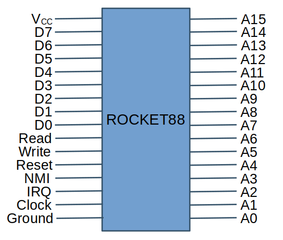
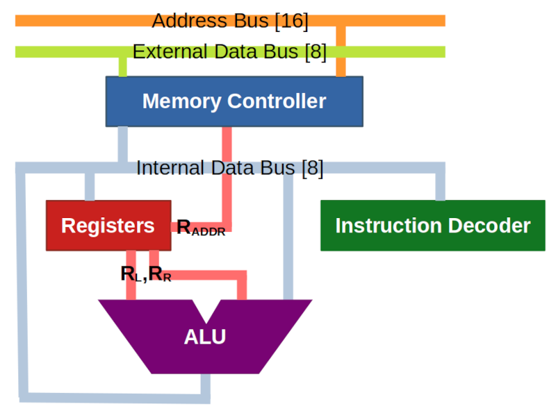
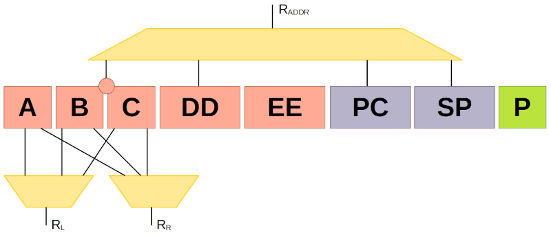
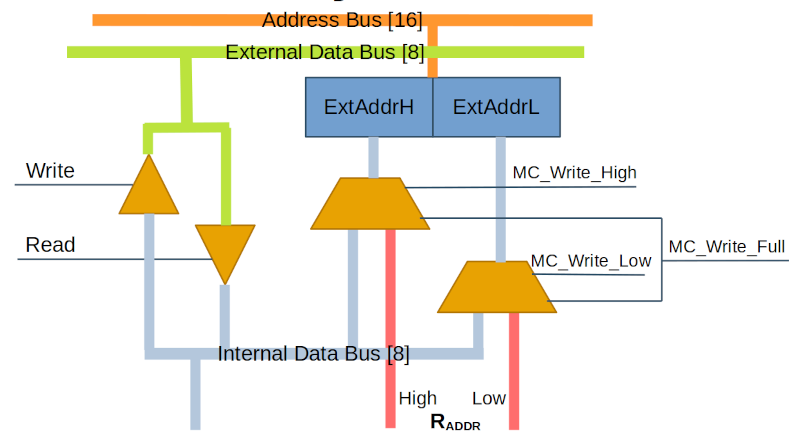

# ROCKET88
## A New 8-Bit Architecture

**ROCKET88** -- **R**etro **O**bsolete **C**omputational **K**ernel for **E**lectronic **T**ransacting (Data Bus: **8**-Bit Internal, **8**-Bit External) -- is a virtual 8-bit architecture for modeled microprocessors, to run either in software emulation or programmable logic. As it is entirely unlikely that a custom silicon implementation will ever be created, this architecture will be free to evolve and have multiple community-developed variants, but ultimately there will be a reference design at https://github.com/SlithyMatt/rocket88 which will include this document, implementations of the architecture in Verilog and C++, and a simple computer system built around this architecture targeting specific FPGA development boards and a software emulator. This repo will take pull requests from the community, but it will be a complete free and open source project and the community is free to make any changes they like in their forks and incorporate it into other free and open source projects, as per the [license](LICENSE).

## Contents
* [External Interface](#external-interface)
* [Internal Components](#internal-components)
* [Instruction Set Architecture](#instruction-set-architecture)
   * [Numerical Syntax](#numerical-syntax)
   * [Addressing Modes](#addressing-modes)
   * [Status Flags](#status-flags)
   * [Opcode Table](#opcode-table)
* [Repository Contents](#repository-contents)

## External Interface
Externally, ROCKET88 will have an 8-bit data bus and a 16-bit address bus. It will operate on a single voltage and clock, and have control pins for reading and writing memory. An I/O connected will need to be mapped to memory, requiring external memory management for any system using a ROCKET88 core. The entire 64k memory space can be used in any fashion, except for the last 6 bytes ($FFFA-$FFFF), which will contain 3 interrupt vectors, but they may be mapped to ROM or RAM. These interrupts will be triggered by NMI, IRQ and RESET pins, and there will also be Read and Write control pins, and that is all.



At power on, the RESET vector will be fetched and execution will begin at the address read there.

### Timing
TBD

### Interrupts
ROCKET88 supports three types of interrupts: Reset, Maskable, and Non-Maskable. These are triggered by the RESET, IRQ and NMI pins, when one of them is held low for the rising edge of a clock cycle. Maskable interrupts can be disabled with software (using the [SEI](doc/set.md#sei) instruction), but a Reset or Non-Maskable Interrupt will always halt program execution and run its service routine. The addresses for these routines must be placed in fixed vectors in memory at the following addresses:

* $FFFA: IRQ Vector
* $FFFC: NMI Vector
* $FFFE: RESET Vector

When powered on, ROCKET88 fetches the RESET Vector, and loads the address stored there into the Program Counter, regardless of the state of any of the interrupt pins. This will make the Reset routine at that address the first code to be executed. Because of this, it is expected that the Reset routine will initialize the Stack Pointer and put the system into a state where it can run the intended software. Often, it is desirable to have the Reset handler in ROM, along with the vectors to make sure that a cold boot is possible and predictable. Let's consider a very simple system that has a memory map as follows:

* $0000-?: ROM code variables
* ?-$0FFF: Default Stack Location
* $1000-EFFF: Program RAM
* $F000-FFFF: ROM

Note that the first 4kB of RAM will be comprised of variable and the stack, but there's no clear division between the two. We don't need it for that example, but it is also instructive to note that ROCKET88 will let you grow the stack a large as you want, which could cause it to overflow into code, data, or even attempt to use ROM, even if it means rolling around to the end of memory after pushing back before the beginning. So, it is up to the software developer to make sure that the stack is contained to its intended segment of RAM.

Let's use this memory map to make a very simple system that will initialize some RAM vectors for IRQ and NMI to allow for software-defined interrupt handling. The following program is for a ROM image that will have a Reset handler that sets up RAM variables and eventually jumps into RAM, as well as default hadndling for IRQ and NMI.

```
IRQ_RAM_VECTOR = $0100
NMI_RAM_VECTOR = $0102

PROGRAM_START = $1000

.org $F000
reset_handler:
   sei                           ; disable maskable interrupts
   lds PROGRAM_START-1           ; initialize stack pointer
   lda #default_irq_handler.low  ; initalize IRQ_RAM_VECTOR to contain address of default handler in ROM
   sta IRQ_RAM_VECTOR
   lda #default_irw_handler.high
   sta IRQ_RAM_VECTOR+1
   lda #default_nmi_handler.low  ; initalize NMI_RAM_VECTOR to contain address of default handler in ROM
   sta NMI_RAM_VECTOR
   lda #default_nmi_handler.high
   sta NMI_RAM_VECTOR+1
   cli                           ; enable maskable interrupts
   jmp PROGRAM_START             ; jump to start of program in RAM

irq_handler:
   ldc IRQ_RAM_VECTOR            ; load address in IRQ_RAM_VECTOR into BC
   ldb IRQ_RAM_VECTOR+1
   jmp (bc)                      ; jump there

default_irq_handler:
   ; do some common, periodic stuff
   rti

nmi_handler:
   ldc NMI_RAM_VECTOR            ; load address in NMI_RAM_VECTOR into BC
   ldb NMI_RAM_VECTOR+1
   jmp (bc)                      ; jump there

default_nmi_handler:
   ; do some rare, critical stuff
   rti

.org $FFFA
.addr irq_handler
.addr nmi_handler
.addr reset_handler
```

This ROM code will be able to boot the following program that can be loaded into RAM, which will also define its own IRQ handler, but keep the default NMI handler.

```
IRQ_RAM_VECTOR = $0100           ; this should probably be in an include file

.org $1000
start:
   sei                           ; disable maskable interrupts
   lda #custom_irq_handler.low   ; copy the address of custom_irq_handler to IRQ_RAM_VECTOR
   sta IRQ_RAM_VECTOR
   lda #custom_irq_handler.high
   sta IRQ_RAM_VECTOR+1
   cli                           ; enable maskable interrupts

loop:
   hlt                           ; halt until interrupt
   ; do something after an interrupt
   jmp loop                      ; keep looping forever

custom_irq_handler:
   ; do extra special things needed for this program for IRQ conditions
   rti
```

So interrupts can be as prescriptive or reactive as the system developer desires. Since IRQs are maskable, they should be triggered by things that are safe to ignore in software. NMIs should occur when a hardware event happens that must be addressed, as they can't be disabled, and like an IRQ it is expected that it will eventually return (usually more quickly than an IRQ, as it has a higher priority) so that the main program can continue. There should be no expectation to return from a Reset, as ROCKET88 will not push the program counter and register states to the stack in that case.

## Internal Components



### Registers
ROCKET88 is focused on register manipulation, with most results being stored in the 8-bit Accumulator, or A register. Additionally, there are two 8-bit general purpose registers named B and C, which can form a single 16-bit address register called BC. Then there are two more special-purpose 16-bit address registers: the Program Counter (PC) and the Stack Pointer (SP), allowing code and the stack to occupy any part of the address space. Then the Processor Status register, also known as P, contains all the status bits, and those are mostly accessed individually. Finally, there are two 16-bit shadow registers named DD and EE which can have their values exchanged with BC to have faster access to pointers and counters without having to fetch them from memory.



For the purposes of this document, we will refer to the high and low bytes of the address registers with the suffixes H and L. For example, the high byte of the Program Counter will be referred to as PCH. In the case of BC, for the sake of simplicty, we will just refer to the individual bytes as B and C, and not BCH and BCL.

### Memory Controller
The Memory Controller (MC) starts each instruction cycle by fetching a byte from memory at the address in PC. This will be the Operation Code, or opcode, for the instruction. The Instruction Decoder then determines what the MC does next based on the opcode. If it requires immediate or direct addressing, then it will fetch the following 1 or 2 bytes (respectively) from memory after incrementing PC each time. Some opcodes will require additional memory accesses after fetching the instruction, to either read or write data in memory. The MC can load its internal address register from the data bus one byte at a time using the lower byte of its internal address wires, filling in either the high byte or the low byte, or filling out the whole address directly from an address register. The Decoder will determine the data source of each byte, and use the MC's write wires accordingly.

* MC_WRITE_LOW - Load address low byte from data bus
* MC_WRITE_HIGH - Load address high byte from data bus
* MC_WRITE_FULL - Load full address from address register demux, selected from BC, PC, SP, or DD

The address register is directly connected to the external address bus, with the Read and Write pins controlling when the address should be interpreted as complete by anything on the bus. The MC does not directly control these pins, but it does use them for timing. When reading from memory, the Decoder will control the Read pin which will pulse for a clock cycle, and the MC will read from the external data bus and load the value into its internal data register, where it can be routed to the internal data bus. The MC_WRITE_DATA wire is used by the Decoder to have the MC route the internal data bus to the external data bus through its internal data register so that the desired output value will be in place for the subsequent pulse of the Write pin, also done by the Decoder.



The Read and Write pins will control how the external data bus is connected to the internal data bus, whether they are disconnected, or if one is driving the other via a pair of 8-bit tristate buffers. Read and Write are controlled by the Decoder, and will only be pulsed once the address register is set with its final value. Write pulses may need to be delayed before being sent to the external pin to allow the tristate buffer it controls to propagate the internal data bus state fully to the external data bus. The external data bus should not change during a pulse of either Read or Write, but the processor can only control this for Write, and mitigate a "bouncy" external data bus during a read pulse by delaying the propagation to the internal data bus.

### Instruction Decoder
The Decoder acts as the main executive of the processor, reading the opcode into its internal register, and then controlling how each half-cycle of the instruction is handled. It provides the selections for all muxes and demuxes connected to the internal buses, as well as the controls for the Arithmetic-Logic Unit (ALU). The Decoder handles the timing of the Read and Write pins, as well as signaling with the MC to read from the internal data bus or load from an address register.

### Arithmetic-Logic Unit
The Arithmetic-Logic Unit (ALU) handles all unary and binary operations performed by the processor. It has primary and secondary inputs that can be values taken from registers or the internal data bus, and then outputs to the internal data bus, where the result can be routed to a register, including the MC data register for writing to memory. The Decoder will handle the demuxing of the inputs, and the muxing of the output once the ALU completes its operation. The ALU will handle the following operations.

Unary (secondary input ignored):
* Pass Through
* Shift left
* Shift right

Binary:
* Add
* Subtract
* Or
* And
* Exclusive Or

To select an operaion, the ALU will have a 3-bit selection control that comes from the Decoder, which will also determine what gets routed to each side of the ALU.
The output of the ALU can also be inverted as an extra selection beyond the operation selection. The ALU not only outputs a result to the data bus, it also sets the status bits based on that result.

## Instruction Set Architecture
The opcodes for ROCKET88 follow a consistent pattern based on their addressing mode and behavior. To see the Instruction Set Architecture (ISA) organized in a tabular form, see the [spreadsheet](Rocket88.ods) in this repo. While some instructions in the ISA have unique behavior and arbitrary placement in the opcode table, the majority are have opcodes that are encoded according to their behavior. The basic structure of most opcodes are as follows.

<table>
<tr><th>Bit:</th><th>7</th><th>6</th><th>5</th><th>4</th><th>3</th><th>2</th><th>1</th><th>0</th></tr>
<tr>Field:</td><td colspan=4>Operation</td><td>Option</td><td colspan=3>Source/Destination Addressing</td></tr>
</table>

The lower 3 bits determine the addressing mode for the opcode, and that will not only determine how data is routed through the processor, but also how many operand bytes will follow the opcode in the program. Most opcodes stand alone and have no operands, but those using the immediate or direct addressing modes will have one or two bytes of operands following the opcode that will need to be fetched to execute the full instruction.

### Numerical Syntax
Assemblers should support the number formats shown in this documentation. Unmarked numeral strings are decimal, marked with a % is binary, and a $ is hexadecimal.
For example, the decimal value 100 can be written as follows:
```
100       ; decimal
%01100100 ; binary
$64       ; hexadecimal
```

Assemblers may use alternative markings, as long as they don't interfere with the standard mnemonics (e.g. using # to denote hexadecimal).

### Addressing Modes
ROCKET88 supports 8 addressing modes, not including fully intrinsic opcodes that have no relevant addressing. This section lists them in the order based on the the 3-bit encoding for them that usually make up the lower 3 bits of the opcode. This section also discusses the assembly language mnemonics for these modes, but that will be also be covered in the reference entries for all instructions.

#### Zero (0)
The Zero mode is not only named after its value in the addressing bits, but also for the immediate value that it represents, namely zero. Rather than requiring the use of the immediate mode to specify zero as an operand, it can just be encoded in the opcode, and the extra byte of operand data will not need to be fetched. It also means that a register doesn't have to be used to contain the value of zero just for the sake of a binary operation, like a comparison.

The mnemonics of Zero mode are flexible. Instructions may use either a dedicated instruction mnemonic or use the immediate mnemonic with a **#0** operand, and the assembler will automatically choose the Zero mode opcode instead of the Immediate opcode followed by a zero byte.

#### A Register (1)
The A Register mode will use the value in the A register as an operand source or the destination of the operation result. This will always be an implicit opcode and require no operands.

The mnemonic will be to simply have A as the assembly operand to specify this mode.

#### B Register (2), C Register (3)
The B and C registers can also be addressed in the same manner as the A register.

#### 16-bit Register
Certain special instructions deal with the value in the BC, DD and EE registers. They only require an implicit opcode, but the assembly mnemonics will use the two-letter register name as an operand. This is not one of the 8 addressing modes that can be encoded within the opcode.

#### Immediate (4)
Immediate addressing will have a single byte as the operand value inline with the code, rather than fetching it from a register or elsewhere in memory. This will require an additional single byte in the code after the opcode, so all instructions using this mode will need to advance the PC by two bytes instead of just one.

The mnemonic for this mode is to precede the immediate value with a hash symbol (#) to indicate that it is a number to be taken at face value and not an address or offset. For the purposes of this documentation, "#N" will be a generic placeholder for an immediate operand, with "N" standing in for a specific 8-bit value.

#### Relative (4)
For jump instructions, there is no purpose for Immediate addressing, so instead jump opcodes that are have immediate encoding actually use relative addressing, which requires a single byte operand, just like immediate mode. However, this value will be a signed offset that will be added to the PC if the jump condition is met.

The mnemonic for this is to use a label, and the assembler will calculate the offset to use for machine code. If the address that label resolves to is too far away from the current PC (more than 128 bytes before, or 127 bytes after), then this will be an assembly error. For the purposes of this documentation, "label" will be a generic placholder for any label that resolves to a specific address within the range of relative addressing.

#### Absolute (5)
Absolute addressing will have a 16-bit (two bytes, little endian) address as an operand, and may require a read from or write to that address to execute the instruction. At any rate, three bytes need to be fetched to get the opcode and address operand, advancing the PC by three.

The mnemonic for this mode is to simply have the address value with no extra punctuation, like a hash or parentheses. For the purposes of this documentation, "NN" will be a generic placeholder for an absolute address.

#### Indirect (6)
Indirect addressing lets you use BC as an address register, and reference data at the address in BC. This means that there is no need to have an operand after the opcode, making it implicit like direct register addressing.

The mnemonic for this mode is to have BC in parentheses instead of a fixed address.

There are also special instructions that use indirect addressing with the DD register, using (DD) for the operand mnemonic.

#### Stack (7)
Stack addressing uses the stack pointer to reference the current top of the stack. As the stack pointer is a dedicated register, opcodes using this mode are implicit.

The mnemonic for this mode is to have SP in parenteses, but some instructions (like PHA) that only support this mode will not require any assembly operand.

### Status Flags

The processor status register, or P for short, contains the status flags that can be affected by the outcomes of certain instructions, and further affect the behavior of the next instruction. While P can be treated as an 8-bit register just like A, B or C, it actually has only six bits, one for each flag. The lower two bits of P do not correspond to any actual flag, so their value is undefined and should be ignored. The upper 6 bits are defined as follows.

| Bit:   | 7 | 6 | 5 | 4 | 3 | 2 | 1 | 0 |
|--------|---|---|---|---|---|---|---|---|
| Flag:  | S | Z | C | I | D | K | - | - |

The letters used for each flag are not directly part of the assembly language mnemonics, but are mainly used for the sake of documentation.

#### Sign (S)

The Sign flag is set when the resulting value is negative, effectively being the same as bit 7. The case of comparison instrctions, S is set when the value in the base register is less than the operand value.

#### Zero (Z)

The zero flag is set when the resulting value is zero. In the case of comparison instructions, Z is set when the values are equal.

#### Carry (C)

The carry flag -- not to be confused with the C register -- is set when a carry or borrow is required when performing arithmetic, to be used by the next arithmetic instruction. It is also used as an effective ninth bit for shifting instructions. For comparison instructions, C is set when the value in the base register is greater than or equal to the operand value.

#### Interrupt Disable (I)

Maskable instrupts are disabled when the I flag is set, and IRQ signals are ignored until the flag is cleared again. The Interrupt Disable flag does not disable Non-Maskable Interrupts or the Reset signal.

#### Decimal (D)

When the Decimal flag is set, addition and subtraction instructions treat input values as binary-coded decimal (BCD), and will output BCD values as well. All instructions revert to binary arithmetic when D is cleared.

#### Break (K)

The break bit is set when the break instruction is executed, can be pulled from the stack along with the rest of the P register, but is cleared by any other instruction. This is mainly read from the stack to determine whether the IRQ routine was triggered by a hardware interrupt or a software-induced break.

### Opcode Table

This table shows which opcodes are documented instructions, and links to the entry for that instruction in the [Instruction Set Reference](doc/instructions.md).

| | x0 | x1 | x2 | x3 | x4 | x5 | x6 | x7 | x8 | x9 | xA | xB | xC | xD | xE | xF |
|-|----|----|----|----|----|----|----|----|----|----|----|----|----|----|----|----|
| **0x** | [NOP](doc/nop.md#nop) | <a href="#note-a">NOP<sup>[a]</sup></a> | <a href="#note-a">NOP<sup>[a]</sup></a> | <a href="#note-a">NOP<sup>[a]</sup></a> | <a href="#note-b">NOP<sup>[b]</sup></a> | <a href="#note-c">NOP<sup>[c]</sup></a> | <a href="#note-a">NOP<sup>[a]</sup></a> | <a href="#note-a">NOP<sup>[a]</sup></a> | <a href="#note-a">NOP<sup>[a]</sup></a> | <a href="#note-a">NOP<sup>[a]</sup></a> | <a href="#note-a">NOP<sup>[a]</sup></a> | <a href="#note-a">NOP<sup>[a]</sup></a> | <a href="#note-b">NOP<sup>[b]</sup></a> | <a href="#note-c">NOP<sup>[c]</sup></a> | <a href="#note-a">NOP<sup>[a]</sup></a> | <a href="#note-a">NOP<sup>[a]</sup></a> |
| **1x** | [LDAZ](doc/ldx.md#lda-ldaz) | [LDA A](doc/ldx.md#lda-ldaz) | [LDA B](doc/ldx.md#lda-ldaz) | [LDA C](doc/ldx.md#lda-ldaz) | [LDA #N](doc/ldx.md#lda-ldaz) | [LDA NN](doc/ldx.md#lda-ldaz) | [LDA (BC)](doc/ldx.md#lda-ldaz) | [PLA](doc/plx.md#pla) | [CPAZ](doc/cpx.md#cpa-cpaz) | [CPA A](doc/cpx.md#cpa-cpaz) | [CPA B](doc/cpx.md#cpa-cpaz) | [CPA C](doc/cpx.md#cpa-cpaz) | [CPA #N](doc/cpx.md#cpa-cpaz) | [STA NN](doc/stx.md#sta) | [STA (BC)](doc/stx.md#sta) | [PHA](doc/phx.md#pha) |
| **2x** | [LDBZ](doc/ldx.md#ldb-ldbz) | [LDB A](doc/ldx.md#ldb-ldbz) | [LDB B](doc/ldx.md#ldb-ldbz) | [LDB C](doc/ldx.md#ldb-ldbz) | [LDB #N](doc/ldx.md#ldb-ldbz) | [LDB NN](doc/ldx.md#ldb-ldbz) | [LDB (BC)](doc/ldx.md#ldb-ldbz) | [PLB](doc/plx.md#plb) | [CPBZ](doc/cpx.md#cpb-cpbz) | [CPB A](doc/cpx.md#cpb-cpbz) | [CPB B](doc/cpx.md#cpb-cpbz) | [CPB C](doc/cpx.md#cpb-cpbz) | [CPB #N](doc/cpx.md#cpb-cpbz) | [STB NN](doc/stx.md#stb) | [STB (BC)](doc/stx.md#stb) | [PHB](doc/phx.md#phb) |
| **3x** | [LDCZ](doc/ldx.md#ldc-ldcz) | [LDC A](doc/ldx.md#ldc-ldcz) | [LDC B](doc/ldx.md#ldc-ldcz) | [LDC C](doc/ldx.md#ldc-ldcz) | [LDC #N](doc/ldx.md#ldc-ldcz) | [LDC NN](doc/ldx.md#ldc-ldcz) | [LDC (BC)](doc/ldx.md#ldc-ldcz) | [PLC](doc/plx.md#plc) | [CPCZ](doc/cpx.md#cpc-cpcz) | [CPC A](doc/cpx.md#cpc-cpcz) | [CPC B](doc/cpx.md#cpc-cpcz) | [CPC C](doc/cpx.md#cpc-cpcz) | [CPC #N](doc/cpx.md#cpc-cpcz) | [STC NN](doc/stx.md#stc) | [STC (BC) ](doc/stx.md#stc)| [PHC](doc/phx.md#phc) |
| **4x** | [EXD](doc/exx.md#exd) | <a href="#note-a">NOP<sup>[a]</sup></a> | <a href="#note-a">NOP<sup>[a]</sup></a> | <a href="#note-a">NOP<sup>[a]</sup></a> | [JMPR label](doc/jmp.md#jmpr) | [JMP NN](doc/jmp.md#jmp) | [JMP (BC)](doc/jmp.md#jmp) | <a href="#note-a">NOP<sup>[a]</sup></a> | [EXE](doc/exx.md#exe) | <a href="#note-a">NOP<sup>[a]</sup></a> | <a href="#note-a">NOP<sup>[a]</sup></a> | <a href="#note-a">NOP<sup>[a]</sup></a> | [JSRR label](doc/jsr.md#jsrr) | [JSR NN](doc/jsr.md#jsr) | [JSR (BC)](doc/jsr.md#jsr) | <a href="#note-a">NOP<sup>[a]</sup></a> |
| **5x** | [LDA (DD)](doc/ldx.md#lda-ldaz) | <a href="#note-a">NOP<sup>[a]</sup></a> | <a href="#note-a">NOP<sup>[a]</sup></a> | <a href="#note-a">NOP<sup>[a]</sup></a> | [JPNZ label](doc/jmp.md#jpnz)</a> | [JMPZ NN](doc/jmp.md#jmpz) | [JMPZ (BC)](doc/jmp.md#jmpz) | <a href="#note-a">NOP<sup>[a]</sup></a> | [STA (DD)](doc/stx.md#sta) | <a href="#note-a">NOP<sup>[a]</sup></a> | <a href="#note-a">NOP<sup>[a]</sup></a> | <a href="#note-a">NOP<sup>[a]</sup></a> | [JSNZ label](doc/jsr.md#jsnz) | [JSRZ NN](doc/jsr.md#jsrz) | [JSRZ (BC)](doc/jsr.md#jsrz) | <a href="#note-a">NOP<sup>[a]</sup></a> |
| **6x** | [INC DD](doc/inc.md) | <a href="#note-a">NOP<sup>[a]</sup></a> | <a href="#note-a">NOP<sup>[a]</sup></a> | <a href="#note-a">NOP<sup>[a]</sup></a> | [JMPP label](doc/jmp.md#jmpp) | [JMPN NN](doc/jmp.md#jmpn) | [JMPN (BC)](doc/jmp.md#jmpn) | <a href="#note-a">NOP<sup>[a]</sup></a> | [DEC DD](doc/dec.md) | <a href="#note-a">NOP<sup>[a]</sup> | <a href="#note-a">NOP<sup>[a]</sup></a> | <a href="#note-a">NOP<sup>[a]</sup></a> | [JSRP label](doc/jsr.md#jsrp) | [JSRN NN](doc/jsr.md#jsrn) | [JSRN (BC)](doc/jsr.md#jsrn) | <a href="#note-a">NOP<sup>[a]</sup></a> |
| **7x** | [INC EE](doc/inc.md) | <a href="#note-a">NOP<sup>[a]</sup></a> | <a href="#note-a">NOP<sup>[a]</sup></a> | <a href="#note-a">NOP<sup>[a]</sup></a> | [JPNC label](doc/jmp.md#jpnc) | [JMPC NN](doc/jmp.md#jmpc) | [JMPC (BC)](doc/jmp.md#jmpc) | <a href="#note-a">NOP<sup>[a]</sup></a> | [DEC EE](doc/dec.md) | <a href="#note-a">NOP<sup>[a]</sup></a> | <a href="#note-a">NOP<sup>[a]</sup></a> | <a href="#note-a">NOP<sup>[a]</sup></a> | [JSNC label](doc/jsr.md#jsnc) | [JSRC NN](doc/jsr.md#jsrc) | [JSRC (BC)](doc/jsr.md#jsrc) | <a href="#note-a">NOP<sup>[a]</sup></a> |
| **8x** | [ADDZ](doc/add.md#add-addz) | [ADD A](doc/add.md#add-addz) | [ADD B](doc/add.md#add-addz) | [ADD C](doc/add.md#add-addz) | [ADD #N](doc/add.md#add-addz) | [ADD NN](doc/add.md#add-addz) | [ADD (BC)](doc/add.md#add-addz) | [INC A](doc/inc.md) | [ADCZ](doc/add.md#adc-adcz) | [ADC A](doc/add.md#adc-adcz) | [ADC B](doc/add.md#adc-adcz) | [ADC C](doc/add.md#adc-adcz) | [ADC #N](doc/add.md#adc-adcz) | [ADC NN](doc/add.md#adc-adcz) | [ADC (BC)](doc/add.md#adc-adcz) | [INC B](doc/inc.md) |
| **9x** | [SUBZ](doc/sub.md#sub-subz) | [SUB A](doc/sub.md#sub-subz) | [SUB B](doc/sub.md#sub-subz) | [SUB C](doc/sub.md#sub-subz) | [SUB #N](doc/sub.md#sub-subz) | [SUB NN](doc/sub.md#sub-subz) | [SUB (BC)](doc/sub.md#sub-subz) | [INC C](doc/inc.md) | [SBCZ](doc/sub.md#sbc-sbcz) | [SBC A](doc/sub.md#sbc-sbcz) | [SBC B](doc/sub.md#sbc-sbcz) | [SBC C](doc/sub.md#sbc-sbcz) | [SBC #N](doc/sub.md#sbc-sbcz) | [SBC NN](doc/sub.md#sbc-sbcz) | [SBC (BC)](doc/sub.md#sbc-sbcz) | [DEC A](doc/dec.md) |
| **Ax** | <a href="#note-a">NOP<sup>[a]</sup></a> | [LSR A](doc/lsr.md) | [LSR B](doc/lsr.md) | [LSR C](doc/lsr.md) | <a href="#note-b">NOP<sup>[b]</sup></a> | [LSR NN](doc/lsr.md) | [LSR (BC)](doc/lsr.md) | [DEC B](doc/dec.md) | <a href="#note-a">NOP<sup>[a]</sup></a> | [ROR A](doc/ror.md) | [ROR B](doc/ror.md) | [ROR C](doc/ror.md) | <a href="#note-b">NOP<sup>[b]</sup></a> | [ROR NN](doc/ror.md) | [ROR (BC)](doc/ror.md) | [DEC C](doc/dec.md) |
| **Bx** | <a href="#note-a">NOP<sup>[a]</sup></a> | [ASL A](doc/asl.md) | [ASL B](doc/asl.md) | [ASL C](doc/asl.md) | <a href="#note-b">NOP<sup>[b]</sup></a> | [ASL NN](doc/asl.md) | [ASL (BC)](doc/asl.md) | [NEG](doc/neg.md) | <a href="#note-a">NOP<sup>[a]</sup></a> | [ROL A](doc/rol.md) | [ROL B](doc/rol.md) | [ROL C](doc/rol.md) | <a href="#note-b">NOP<sup>[b]</sup></a> | [ROL NN](doc/rol.md) | [ROL (BC)](doc/rol.md) | [INC (BC)](doc/inc.md) |
| **Cx** | [ORZ](doc/or.md#ora-orz) | [ORA A](doc/or.md#ora-orz) | [ORA B](doc/or.md#ora-orz) | [ORA C](doc/or.md#ora-orz) | [ORA #N](doc/or.md#ora-orz) | [ORA NN](doc/or.md#ora-orz) | [ORA (BC)](doc/or.md#ora-orz) | [INV B](doc/inv.md) | [NORZ](doc/or.md#nor-norz) | [NOR A](doc/or.md#nor-norz) | [NOR B](doc/or.md#nor-norz) | [NOR C](doc/or.md#nor-norz) | [NOR #N](doc/or.md#nor-norz) | [NOR NN](doc/or.md#nor-norz) | [NOR (BC)](doc/or.md#nor-norz) | [INV C](doc/inv.md) | 
| **Dx** | [ANDZ](doc/and.md#and-andz) | [AND A](doc/and.md#and-andz) | [AND B](doc/and.md#and-andz) | [AND C](doc/and.md#and-andz) | [AND #N](doc/and.md#and-andz) | [AND NN](doc/and.md#and-andz) | [AND (BC)](doc/and.md#and-andz) | [SED](doc/set.md#sed) | [NNDZ](doc/and.md#nnd-nndz) | [NND A](doc/and.md#nnd-nndz) | [NND B](doc/and.md#nnd-nndz) | [NND C](doc/and.md#nnd-nndz) | [NND #N](doc/and.md#nnd-nndz) | [NND NN](doc/and.md#nnd-nndz) | [NND (BC)](doc/and.md#nnd-nndz) | [CLD](doc/clx.md#cld) | 
| **Ex** | [XORZ](doc/xor.md#xor-xorz) | [XOR A](doc/xor.md#xor-xorz) | [XOR B](doc/xor.md#xor-xorz) | [XOR C](doc/xor.md#xor-xorz) | [XOR #N](doc/xor.md#xor-xorz) | [XOR NN](doc/xor.md#xor-xorz) | [XOR (BC)](doc/xor.md#xor-xorz) | [PHP](doc/phx.md#php) | [XNRZ](doc/xor.md#xnr-xnrz) | [XNR A](doc/xor.md#xnr-xnrz) | [XNR B](doc/xor.md#xnr-xnrz) | [XNR C](doc/xor.md#xnr-xnrz) | [XNR #N](doc/xor.md#xnr-xnrz) | [XNR NN](doc/xor.md#xnr-xnrz) | [XNR (BC)](doc/xor.md#xnr-xnrz) | [PLP](doc/plx.md#plp) | 
| **Fx** | [SEI](doc/set.md#sei) | [CLI](doc/clx.md#cli) | [RTS](doc/ret.md#rts) | [RTI](doc/ret.md#rti) | [HLT](doc/hlt.md) | [BRK](doc/brk.md) | [RST](doc/rst.md) | [LDS NN](doc/ldx.md#lds) | [LDS BC](doc/ldx.md#lds) | [LDS (BC)](doc/ldx.md#lds) | [LBCS](doc/ldx.md#lbcs) | [CLC](doc/clx.md#clc) | [SEC](doc/set.md#sec) | [INC BC](doc/inc.md) | [DEC BC](doc/dec.md) | <a href="#note-a">NOP<sup>[a]</sup></a> |


#### Note a
Alternative opcode for NOP. See [NOP documentation](doc/nop.md#implicit).

#### Note b
Effectively the same as NOP, but also expects a one-byte operand that will be fetched but ignored. See [NOP documentation](doc/nop.md#immediate).

#### Note c
Effectively the same as NOP, but also expects a two-byte operand that will be fetched but ignored. See [NOP documentation](doc/nop.md#absolute).

## Repository Contents

### Documentation
If you're reading this, you're there already! All the documentation is in markdown, mostly in the [doc](../../tree/main/doc) directory, which contains detailed information about each instruction, as linked in the [opcode table](#opcode-table) above.

### Verilog Core
The code for implementing ROCKET88 on an FPGA is being written in the Verilog hardware description language (HDL). In the [verilog](../../tree/main/verilog) directory, you'll find the Verilog code, starting with [Rocket88.v](verilog/Rocket88.v), which is the top-level module for the core. The non-Verilog files (with extensions other than .v) are for a Quartus project that will deploy this core to the Terasic DE10 Nano development board. Using this project isn't necessary if you are using a different board or toolchain, as you can just take the .v files and import them into another project for another board.

Separate from this core project will be another project in another repository for the ROCKET88 reference computer. It will also be targeting the DE10 Nano, and in turn, the [MiSTer](http://www.mistercores.com/mister/), where it can be deployed alongside other retro system cores. Eventually, there will be forks of this reference computer that will target other development boards, providing a complete system for people to use on multiple hardware platforms.

### Emulator Core Library
The reference computer will also exist as a software emulator that can run on Linux, Mac or even Windows. Like the Verilog implementation, this repo will contain only the code for the core emulation, which will be compiled into a library that can be linked into the reference computer emulator, or even into a different emulator.

### Assembler
Whether you are using an FPGA-based single board computer or a software emulator based on the ROCKET88 core, you are going to need an assembler to write code for it, unless you're the kind of person who likes to just write binary machine code. The official assembler in this repo will compile and run on any environment that supports the GNU toolchain, and release binaries will be made available for x86-64 Linux and Windows.
